<div align="center">
  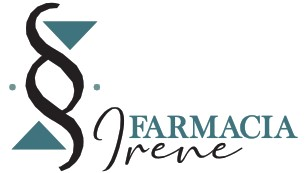
  <h1 align="center">Sistema de Conteo y Seguimiento de Personas en Farmacias</h1>
  <p align="center">Análisis avanzado de comportamiento de clientes mediante visión por computadora</p>
</div>

<div align="center">
  <a href="https://python.org">
    
  </a>
  <a href="#">
    
  </a>
  <a href="#">
    
  </a>
</div>

## 🌟 Características Destacadas

| Característica | Descripción |
|----------------|-------------|
| **Detección precisa** | Uso de YOLOv5 y YOLOv8 para detección de personas con alta precisión |
| **Seguimiento avanzado** | DeepSORT para seguimiento persistente incluso con oclusiones |
| **Análisis espacial** | Definición de zonas poligonales y líneas virtuales para análisis detallado |
| **Mapas de calor** | Visualización intuitiva de patrones de tráfico y densidad |
| **Privacidad garantizada** | Pixelado en tiempo real y procesamiento local sin transmisión externa |
| **Interfaz intuitiva** | Diseño pensado para usuarios no técnicos con CustomTkinter |

## 📹 Demo

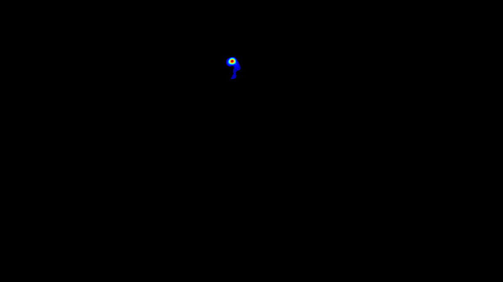

_Ejemplo de mapa de calor generado por el sistema mostrando patrones de tráfico en una farmacia_

## 🖼️ Galería

### **Interfaz Principal**

La interfaz principal de la aplicación, desarrollada con CustomTkinter, ofrece un diseño moderno y accesible. Desde aquí, se pueden acceder a todas las herramientas de configuración, procesamiento y visualización.

| 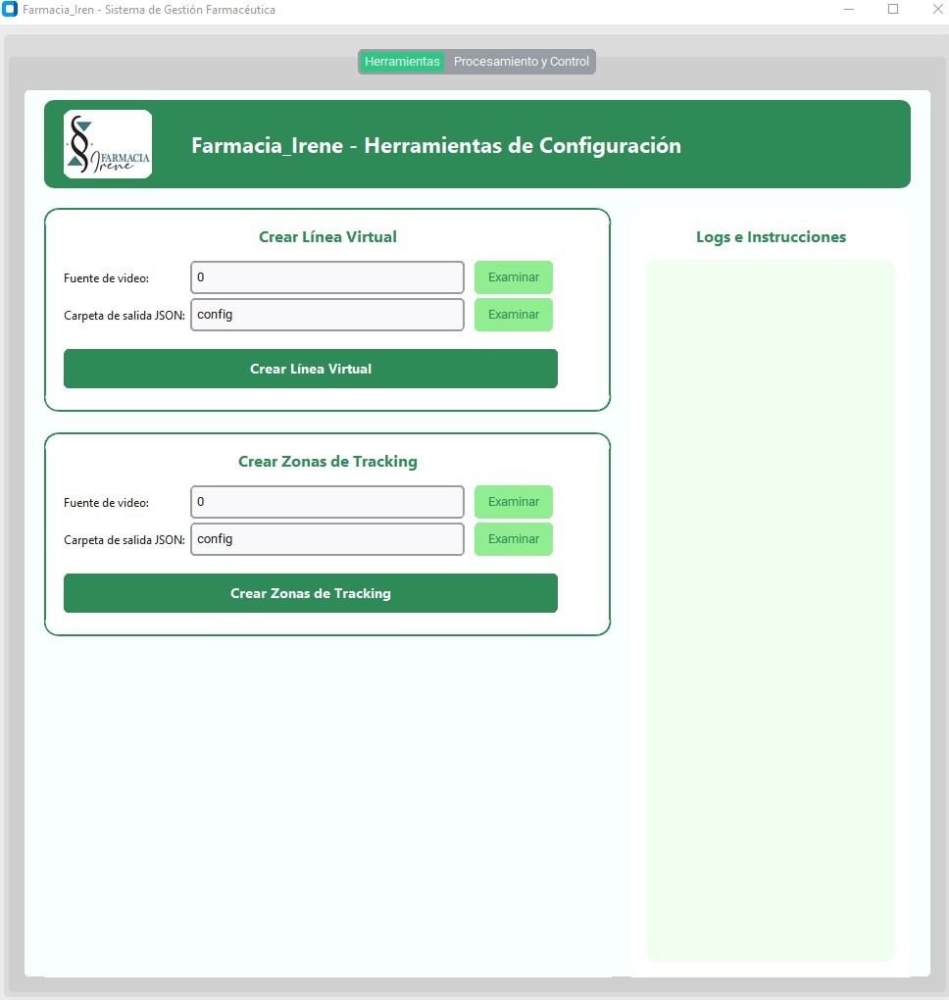 | 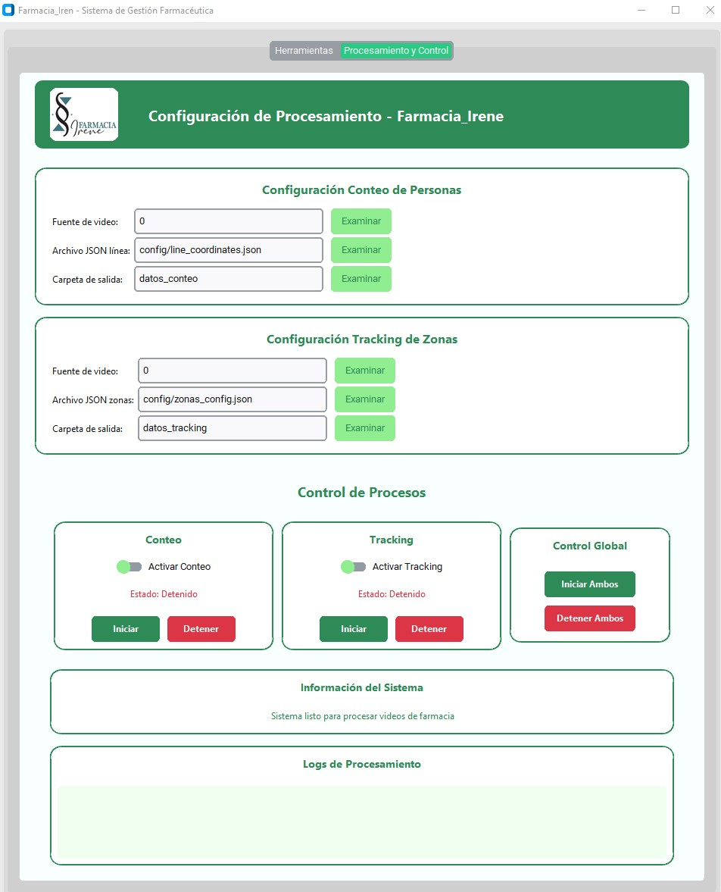 |
| :---: | :---: |
| *Vista principal del panel de control* | *Opciones avanzadas de procesamiento y control* |

### **Herramientas de Configuración**

El sistema incluye herramientas interactivas que simplifican la configuración de las zonas de análisis. Con solo unos clics, puedes definir líneas virtuales para el conteo de personas y zonas poligonales para el seguimiento de comportamientos.

| 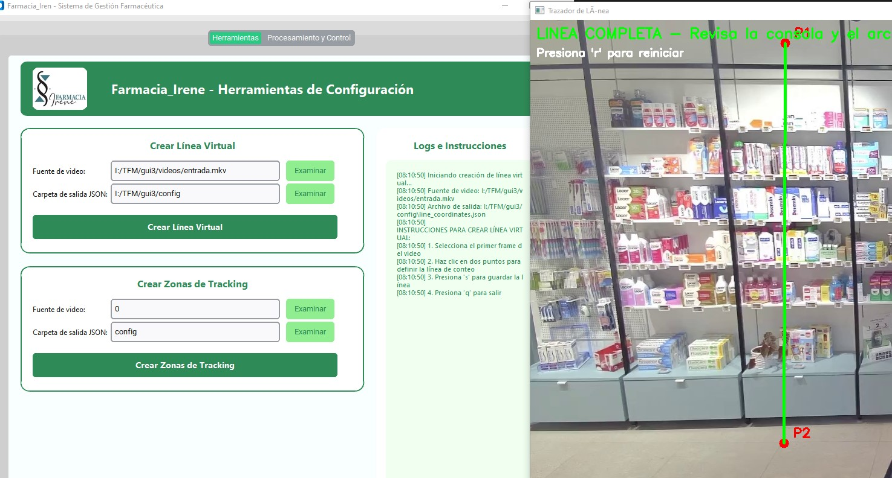 | 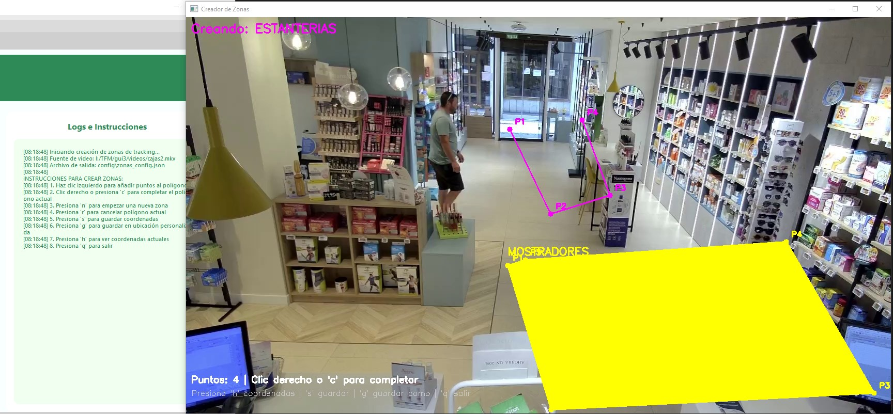 |
| :---: | :---: |
| *Definición de líneas virtuales (`crear_linea.py`)* | *Creación de zonas poligonales (`crear_zonas.py`)* |

### **Módulo de Conteo de Personas**

El módulo de conteo utiliza el modelo YOLOv5 para detectar y cuantificar a las personas que cruzan las líneas definidas. Puedes elegir visualizar el vídeo con o sin pixelado para proteger la privacidad.

| 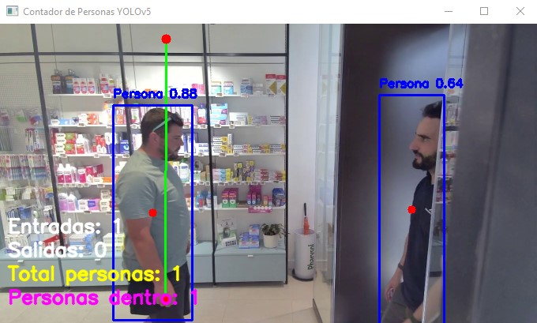 | 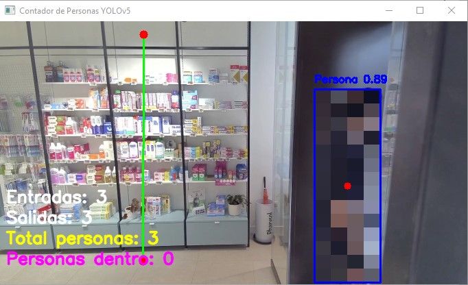 |
| :---: | :---: |
| *Conteo sin pixelado en tiempo real* | *Conteo con pixelado para mayor privacidad* |

### **Módulo de Tracking y Mapa de Calor**

El módulo de seguimiento avanzado, basado en YOLOv8 y DeepSORT, permite un monitoreo detallado de las trayectorias y genera mapas de calor para identificar las zonas de mayor afluencia.

| 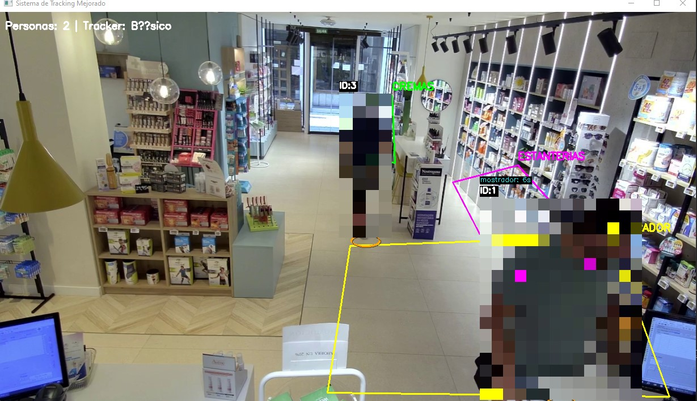 | 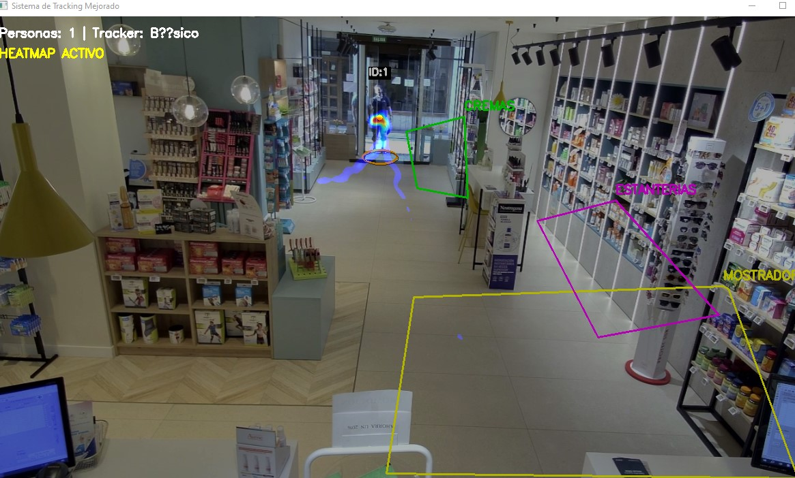 |
| :---: | :---: |
| *Seguimiento de trayectorias en vivo* | *Visualización del mapa de calor generado* |
## Autor
- **Nombre:** Guillermo
- **Máster:** [Nombre del Máster]
- **Fecha:** [Fecha Actual]

## Resumen
Este Trabajo Fin de Máster (TFM) presenta un sistema de conteo y seguimiento de personas en entornos de farmacias utilizando visión por computadora y aprendizaje profundo. El sistema utiliza modelos preentrenados de YOLO (You Only Look Once) para la detección de objetos, específicamente personas, y algoritmos de seguimiento para monitorear su movimiento a través de zonas definidas y líneas de conteo.

El objetivo principal es proporcionar herramientas para analizar el flujo de clientes en farmacias, generando datos sobre conteo de entradas/salidas, tiempo de permanencia en zonas específicas y mapas de calor para visualizar áreas de alta actividad. Esto puede ayudar en la optimización de layouts, gestión de personal y mejora de la experiencia del cliente.

## Objetivos
1. **Detección y Conteo de Personas:** Implementar un sistema que cuente personas cruzando líneas específicas (ej. entradas/salidas).
2. **Seguimiento en Zonas:** Monitorear el tiempo que las personas pasan en zonas predefinidas del espacio.
3. **Generación de Mapas de Calor:** Crear visualizaciones de densidad de movimiento para identificar áreas populares.
4. **Interfaz Gráfica:** Desarrollar una UI simple para configuración y visualización de resultados.
5. **Análisis de Datos:** Almacenar y exportar datos para análisis posterior.

## Metodología
### Tecnologías Utilizadas
- **Python 3.8+**
- **YOLOv5** para conteo de personas y **YOLOv8** para seguimiento avanzado de personas.
- **OpenCV** para procesamiento de video e imágenes.
- **SORT** (Simple Online and Realtime Tracking) para seguimiento de objetos.
- **Tkinter** para la interfaz gráfica.
- **JSON** para almacenamiento de configuraciones y datos.

### Flujo de Trabajo

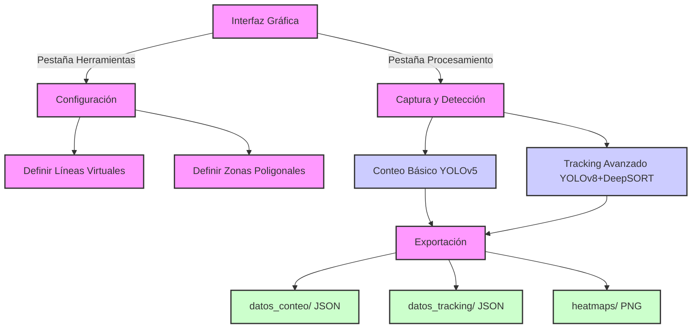

### Componentes Principales
1. **Configuración de Líneas y Zonas:**
   - Scripts para definir líneas de conteo y zonas poligonales interactivamente (`crear_linea.py` y `crear_zonas.py`).

2. **Sistema de Conteo:**
   - Detecta personas cruzando líneas definidas (`conteo.py`).
   - Registra entradas y salidas.

3. **Sistema de Seguimiento:**
   - Rastrea trayectorias de personas (`tracking.py`).
   - Calcula tiempo en zonas.
   - Genera mapas de calor basados en posiciones.

4. **Interfaz Gráfica:**
   - UI principal para lanzar configuraciones y ejecuciones (`uiFarmacia_logo.py`).

5. **Almacenamiento de Datos:**
   - Resultados en JSON en `datos_conteo/` y `datos_tracking/`.
   - Mapas de calor como imágenes PNG en `heatmaps/`.
6. **Medidas de Privacidad:**
  - Pixelado en tiempo real de personas detectadas mediante tecla 'p'.
  - Procesamiento local sin transmisión a servicios externos.
  - Cumplimiento RGPD mediante anonimización y minimización de datos.

## Estructura del Proyecto
```
├── conteo.py
├── crear_linea.py
├── crear_zonas.py
├── README.md
├── requirements.txt
├── tracking.py
├── uiFarmacia_logo.py
├── yolov5s.pt
├── yolov8s.pt
├── config/
│   ├── line_coordinates.json
│   └── zonas_config.json
├── datos_conteo/
├── datos_tracking/
├── heatmaps/
├── Logo/
│   └── logo.jpg
└── videos/
```

## 🛠️ Instalación

### Requisitos previos
- Python 3.8+
- pip (gestor de paquetes de Python)

### Pasos de instalación
1.  Clonar el repositorio:
    ```bash
    git clone https://github.com/PatataPyhton/farmacia_traking_TFM.git
    cd farmacia_traking_TFM
    ```
2.  Crear y activar un entorno virtual (recomendado):
    ```bash
    python -m venv venv
    venv\Scripts\activate  # Windows
    # source venv/bin/activate  # Linux/Mac
    ```
3.  Instalar dependencias:
    ```bash
    pip install -r requirements.txt
    ```
4.  Los modelos YOLOv5s y YOLOv8s ya están incluidos en el repositorio

## Uso
### Interfaz Gráfica Principal
El sistema se opera completamente desde la interfaz gráfica, que sirve como punto de entrada único para todas las funcionalidades:

1.  **Iniciar la interfaz**:
    ```bash
    python uiFarmacia_logo.py
    ```
2.  **Configuración Inicial** (pestaña "Herramientas"):
    -   Seleccionar fuente de video (webcam o archivo)
    -   Especificar directorio de salida
    -   Ejecutar "Crear Línea" para definir líneas de conteo mediante clics del ratón
    -   Ejecutar "Crear Zonas" para definir áreas poligonales con nombres descriptivos
    -   Los archivos de configuración se guardan automáticamente como `line_coordinates.json` y `zonas_config.json`
3.  **Procesamiento y Análisis** (pestaña "Procesamiento y Control"):
    -   Seleccionar fuentes de video y archivos de configuración
    -   Presionar "Iniciar Conteo" para activar el sistema de conteo básico (YOLOv5)
    -   Presionar "Iniciar Tracking" para activar el sistema avanzado de seguimiento (YOLOv8 + DeepSORT)
    -   Controlar en tiempo real mediante botones de la interfaz (no mediante teclas)
    -   Visualizar resultados en la ventana principal de la interfaz

### Flujo de Trabajo Completo
El sistema sigue un flujo estructurado en cuatro fases:
1. **Configuración**: Definición de líneas y zonas mediante la interfaz
2. **Captura**: Selección de fuentes de video y parámetros desde la interfaz
3. **Procesamiento**: Ejecución de módulos de conteo/tracking en segundo plano
4. **Exportación**: Generación automática de JSON y mapas de calor al finalizar

### Controles desde la Interfaz
- **Configuración**:
  - Botones para iniciar herramientas de configuración
  - Selección de directorios y fuentes de video
- **Ejecución**:
  - Botones "Iniciar"/"Detener" para cada módulo
  - Visualización integrada de resultados
  - Opciones para activar/desactivar pixelado y mapas de calor
  - Exportación automática al finalizar


### Parámetros
- `--video`: Ruta al video de entrada (requerido).
- `--model`: Modelo YOLO a usar (yolov5s.pt o yolov8s.pt, default: yolov5s.pt).
- `--conf`: Umbral de confianza para detecciones (default: 0.25).

## Resultados
- Archivos JSON en `datos_conteo/` con conteos de entradas/salidas.
- Archivos JSON en `datos_tracking/` con tiempos por zona por ID de objeto.
- Mapas de calor en `heatmaps/` como PNG.

### Estructura de Datos
**Conteo** (`datos_conteo/*.json`):
```json
{
  "entradas": 15,
  "salidas": 12,
  "total_personas": 27,
  "personas_dentro": 3,
  "timestamp": "2025-09-05T14:42:45.598Z"
}
```

**Tracking** (`datos_tracking/*.json`):
```json
{
  "timestamp": "20250905_144534",
  "total_personas": 5,
  "sistema_tracking": "DeepSORT",
  "personas": [
    {
      "id": 1,
      "zona_actual": "mostrador",
      "tiempo_en_zona_actual": 45.2,
      "historial_zonas": [
        {
          "zona": "entrada",
          "tiempo_entrada": "2025-09-05T14:40:00",
          "tiempo_salida": "2025-09-05T14:40:30",
          "duracion": 30.0
        }
      ],
      "centroid": [320, 240],
      "ultima_actualizacion": "2025-09-05T14:45:34"
    }
  ]
}
```


##  Créditos

Este proyecto fue desarrollado como Trabajo Fin de Máster por:

- **Guillermo** - [PatataPython](https://github.com/koikawe)

Agradecimientos especiales a:
- [Ultralytics](https://ultralytics.com/) por los modelos YOLO
- [OpenCV](https://opencv.org/) por la biblioteca de visión por computadora

## 📜 Licencia

Este proyecto está bajo la Licencia MIT - consulta el archivo [LICENSE](LICENSE) para más detalles.
